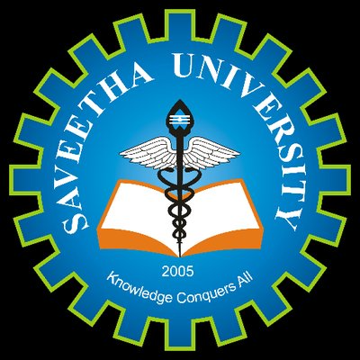
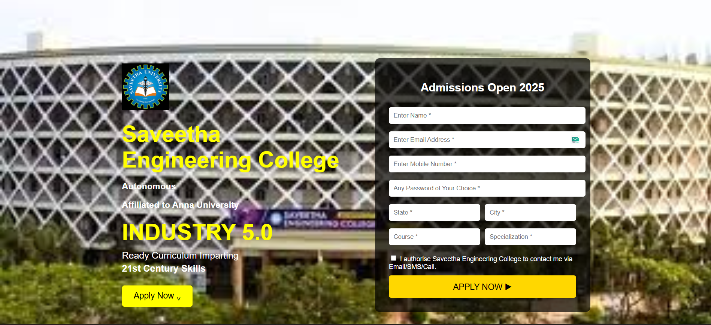

# Saveetha_Admission_clone
## Date: 09-07-2025

## Objective:
To design a landing page clone of Saveetha Engineering College’s Admission Enquiry form using HTML and CSS. This activity reinforces skills in layout design, form creation, user input handling, responsive structure, and visual styling based on a real-world example.

## Tasks:
#### 1. Analyze the Landing Page Layout:
Observe the split-screen layout with a promotional section on the left and a form on the right.

Note the use of background images, text styling, and branding elements.

#### 2. Create the HTML Structure:
Use semantic tags like ```<section>, <header>, <form>, and <footer>``` to organize content.

Structure the form with input fields such as name, email, phone, password, city, state, course, specialization, captcha, and checkbox.

#### 3. Add Form Functionality:
Include appropriate input types (text, email, tel, password, select, etc.) with placeholders and labels.

Use the <button> element for the "APPLY NOW" action.

#### 4. Apply CSS Styling:
Implement a split layout using flexbox or grid.

Style the form elements with padding, shadows, background colors, and rounded borders.

Include hover effects and button transitions to match the original look.

#### 5. Incorporate Images and Branding:
Add the institution logo and use matching fonts and colors.

Place a background image or blurred overlay behind the form content if needed.

#### 6. Ensure Responsiveness:
Make sure the page adapts to different screen sizes using media queries.

Maintain readability and layout integrity on both desktop and mobile.

## HTML Code:
```html
<!DOCTYPE html>
<html lang="en">
<head>
    <meta charset="UTF-8">
    <title>Saveetha Engineering College</title>
    <link rel="stylesheet" href="style.css">
</head>
<body>
    <div class="container">
        <div class="left-section">
            
            <h1>Saveetha Engineering College</h1>
            <h3>Autonomous</h3>
            <h3>Affiliated to Anna University</h3>
            <h1>INDUSTRY 5.0</h1>
            <p>Ready Curriculum Imparting</p>
            <p><strong>21st Century Skills</strong></p>
            <button class="apply-btn">Apply Now ⌄</button>
        </div>
        <div class="form-section">
            <h2>Admissions Open 2025</h2>
            <form>
                <input type="text" placeholder="Enter Name *" required>
                <input type="email" placeholder="Enter Email Address *" required>
                <input type="tel" placeholder="Enter Mobile Number *" required>
                <input type="password" placeholder="Any Password of Your Choice *" required>
                <div class="row">
                    <input type="text" placeholder="State *" required>
                    <input type="text" placeholder="City *" required>
                </div>
                <div class="row">
                    <input type="text" placeholder="Course *" required>
                    <input type="text" placeholder="Specialization *" required>
                </div>
                
                <label class="checkbox">
                    <input type="checkbox" required> I authorise Saveetha Engineering College to contact me via Email/SMS/Call.
                </label>
                <button type="submit" class="submit-btn">APPLY NOW ▶</button>
            </form>
        </div>
    </div>
</body>
</html>
```

## CSS Code:
```css
body {
    font-family: Arial, sans-serif;
    margin: 0;
    padding: 0;
    background-image: url(image.png);
    background-repeat: no-repeat;
    background-size: contain;
    color: rgb(255, 255, 255);
}

.container {
    display: flex;
    min-height: 100vh;
    align-items: center;
    justify-content: center;
    gap: 40px;
    padding: 50px;
}
.logo{
    width: 20%;
    height: auto;
}
.left-section {
    flex: 1;
    max-width: 500px;
}

.left-section h1 {
    font-size: 48px;
    color: yellow;
    margin: 20px 0 10px;
}

.left-section p {
    font-size: 20px;
    margin: 5px 0;
}

.apply-btn {
    margin-top: 20px;
    padding: 12px 25px;
    font-size: 18px;
    background-color: yellow;
    color: black;
    border: none;
    border-radius: 5px;
    cursor: pointer;
}

.form-section {
    background: rgba(0, 0, 0, 0.7);
    padding: 30px;
    border-radius: 10px;
    width: 400px;
}

.form-section h2 {
    text-align: center;
    margin-bottom: 20px;
    color: white;
}

form input[type="text"],
form input[type="email"],
form input[type="password"],
form input[type="tel"] {
    width: 100%;
    padding: 10px;
    margin: 8px 0;
    border-radius: 5px;
    border: none;
}

.row {
    display: flex;
    gap: 10px;
}

.row input {
    flex: 1;
}

.checkbox {
    display: block;
    margin: 10px 0;
    font-size: 14px;
}

.submit-btn {
    width: 100%;
    padding: 12px;
    background-color: gold;
    color: black;
    font-size: 18px;
    border: none;
    border-radius: 5px;
    cursor: pointer;
}

.login-link {
    text-align: center;
    margin-top: 10px;
    font-size: 14px;
}

.login-link a {
    color: #ffd700;
    text-decoration: none;
}

```
## Output:


## Result:
A landing page clone of Saveetha Engineering College’s Admission Enquiry form using HTML and CSS is designed successfully.
